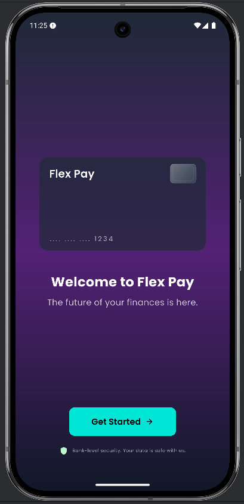
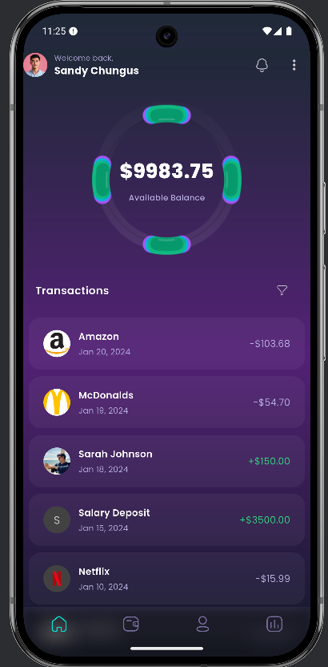
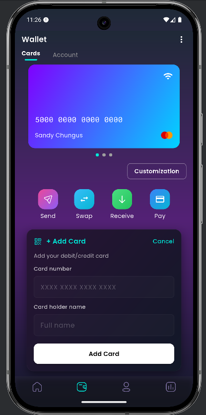
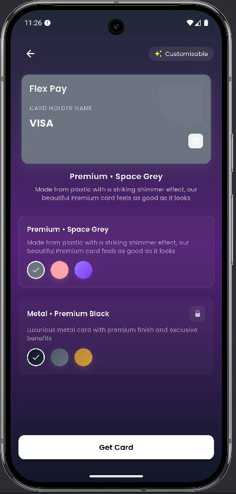

# Flex Pay — Flutter UI Clone

A Flutter UI clone of the **Flex Pay** app screens (Welcome, Home, Wallet, and Card Customization), implemented from scratch with a clean architecture and modular structure.

**Design Credit:** [Flex Pay — Figma Design](https://www.figma.com/design/5kPJFKVjFBSMGB1LGv0ozm/Flex-Pay?node-id=0-1&p=f&t=qM9Nl2ea9Xu3rsM5-0)  
**Author / Portfolio:** [Parikshit](https://parikshit.techycodex.com)

---
✨ Screenshots
| Welcome | Home |
|--------:|:----:|
|  |  |

| Wallet | Card Customization |
|:------:|:------------------:|
|  |  |

---

## 📱 Project Overview

This project is a Flutter-based replication of the Flex Pay design with:
- Pixel-perfect UI implementation.
- Modular folder structure (controllers, models, screens, utils).
- Reusable widgets (like `GradientScaffold`).
- GetX state management for controllers.
- Organized assets and screenshots.

---

## 📂 Folder Structure

```plaintext
lib/
 ├─ constant/
 │   └─ app_colors.dart
 ├─ core/
 │   ├─ app.dart
 │   └─ app_theme.dart
 ├─ models/
 │   └─ transaction_model.dart
 ├─ modules/
 │   ├─ home/
 │   │  └─ home_controller.dart
 │   └─ wallet/
 │      ├─ card_customization_controller.dart
 │      └─ wallet_controller.dart
 ├─ routes/
 │   ├─ appRoutes.dart
 │   └─ navigator_service.dart
 ├─ screens/
 │   ├─ home/
 │   │  └─ home_screen.dart
 │   ├─ mainnav/
 │   │  └─ mainnav_screen.dart
 │   ├─ wallet/
 │   │  ├─ card_customization_screen.dart
 │   │  └─ wallet_screen.dart
 │   └─ welcome/
 │      └─ welcome_screen.dart
 ├─ utils/
 │  └─ gradient_scaffold.dart
 └─ main.dart
 ```
---
🚀 Getting Started
Prerequisites

* Flutter SDK (latest stable version)
* Dart SDK
* IDE: VSCode / Android Studio

Installation
```plaintext
Clone the repository:

git clone <your-repo-link>
cd flexpay_ui_clone


Install dependencies:

flutter pub get


Run the project:

flutter run
```
📦 Dependencies

Add the following dependencies in pubspec.yaml:
```plaintext
dependencies:
  flutter:
    sdk: flutter
  get: ^4.6.5
  google_fonts: ^3.0.1
  sizer: ^2.0.15
```
📝 License & Attribution

This UI is a reproduction inspired by the Figma design linked above.
All design credit goes to the original creator.

Developed by Parikshit